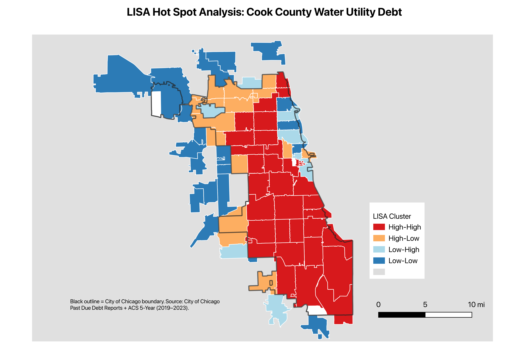

# 1. Introduction

In many American metropolitan areas, economic disparities and wage gaps are vividly apparent. Chicago in particular is characterized by a history of highly disproportionate wages and instances of redlining. Presently, there is still substantial socioeconomic variation across ZIP codes, reflecting a long-standing pattern of segregation and uneven economic development. (Schwegman, 2025). Consequently, Chicago provides the opportunity to investigate a compelling case study on understanding income inequality and demographic composition through the lens of water utility debt. Existing research reveals that in Chicago there are large clusters of neighborhoods that face issues of water unaffordability, which can be a sign of low income communities. This indicates that water utility debt is a factor of uneven distribution of wealth at a local level (Cardoso and Wichman, 2022).

# 2. Research Question

**Spatial Analysis Question:** How is household water utility debt distributed across Cook County, and what does the resulting spatial pattern reveal about the relationship between region, race, and income disparity in Chicago?

While water affordability challenges exist across multiple U.S. cities, their issues often exhibit spatial patterns across neighborhoods. This makes Chicago an important and relevant case for examining how utility burdens and affordability challenges vary across urban communities. Chicago has a history of residential segregation and redlining that produced significant differences in income levels, infrastructure investment, and racial demographics throughout neighborhoods. It is important to understand the implications that spatial segregation has on water accessibility in metropolitan regions such as Chicago. Understanding the underlying historical context can help influence modern day policy and create better cost allocation mechanisms within large scarcity regions.

# 3. Data Sources

## Importing Data Sources

To obtain the utiltiy debt data, I downloaded pdf data from the City of Chicago’s Department of Finance annual reports on outstanding past due utility debt which I secured from the years of 2022-2024. This data is organized in two tables one of which shows utility debt from each ZIP code for various service classes or types of building. The following table, also organized by ZIP code shows the debt for each type of structured building and includes information on how many days past due for the total number of accounts that have acquired any debt over the year. I also used American Community Survey (ACS) data conducted by the U.S. Census Bureau at the ZIP code level from 2019 - 2023. For the Spatial data, I used the tigris package to download the Chicago 2020 ZCTAs

```{r}
#| label: setup
#| include: false
#importing libaries 
library(pdftools)
library(stringr)
library(dplyr)
library(readr)
library(tidyr)
library(purrr)
library(fs)
library(broom)
library(ggplot2)
library(stargazer)
library(modelsummary)
library(sf)
library(tigris)
library(here)
library(leaflet)
options(tigris_use_cache = TRUE)
```

```{r}

cook <- st_read("cook_county_debt.geojson", quiet = TRUE)
```

# 4. Data Cleaning

## Data Cleaning and Preprocessing Steps

During the data cleaning and preprocessing prep, I cleaned and combined three data sets into the final spatial data set used for this analysis. Within the first data set provided by the City of Chicago and our main exploratory variable - water utility debt by ZIP, I parsed through the three pdfs of the data from each year using pdftools package. The final data set was a long format aggregation of the total residential debt per ZIP region and year. The next step, I used ACS census data from 2019-2023 for the racial composition and median household income. Within these data sets I derived multiple variables such as log forms of the utility debt and income debt to normalize the distributions. I also created demographic derivation of pct_white, pct_black, and pct_asian.

The third data set and final preprocessing step was to include the spatial variable component for the Chicago city Zipcodes. I did this using the tigris package and subset it to cook count. The three sources were merged to produce a spatial data set of Cook County ZCTAs with attached debt, demographic, and income variables in the final data set labeled cook_county_debt.geojson.

```{r}
#| eval: false
# =========================================================
# PREPROCESSING SCRIPT - R VERSION
# Translated from preprocessing_actual.py
# Cook County water utility debt + ACS demographic / income data
# =========================================================

# ---- Required packages -------------------------------------------------
install.packages(c("pdftools","stringr","dplyr","readr","tidyr",
              "purrr","fs","broom","ggplot2","stargazer","modelsummary",
                   "sf","tigris"))

library(pdftools)
library(stringr)
library(dplyr)
library(readr)
library(tidyr)
library(purrr)
library(fs)
library(broom)
library(ggplot2)
library(stargazer)
library(modelsummary)
library(sf)
library(tigris)
options(tigris_use_cache = TRUE)

# =========================================================
# DATA DIRECTORY (UPDATE YOUR PATH)
# =========================================================

DATA_DIR <- "/Users/roshnivora/Desktop/School/Year2Classes/WinterQuarter/BDD/BDD_data"

PDF_FILES <- list(
  "2022" = file.path(DATA_DIR, "2022 Past Due Debt Report.pdf"),
  "2023" = file.path(DATA_DIR, "2023 Past Due Debt Report.pdf"),
  "2024" = file.path(DATA_DIR, "Outstanding Past Due Utility Debt - 2024.pdf")
)

OUTPUT_DIR <- file.path(DATA_DIR, "processed_debt_data")
dir_create(OUTPUT_DIR)

# =========================================================
# COLUMN STRUCTURES
# =========================================================

BALANCE_COLS <- c(
  "zip",
  "domestic_residential_occupancy",
  "single_family_dwellings",
  "two_unit_residential_structures",
  "three_unit_residential_structures",
  "four_unit_residential_structures",
  "five_unit_residential_structures",
  "six_to_12_unit_residential_structures",
  "more_than_12_unit_residential_structures",
  "combination_residential_commercial_structures",
  "commercial_structures",
  "industrial_structures",
  "grand_total",
  "year"
)

AGED_COLS <- c(
  "zip",
  "service_class",
  "account_count",
  "days_30",
  "days_60",
  "days_90",
  "days_180",
  "days_365_plus",
  "total_past_due",
  "year"
)

SERVICE_CLASS_MAP <- c(
  "domestic residential occupancy"                       = "domestic_residential_occupancy",
  "single-family dwellings"                              = "single_family_dwellings",
  "two-unit residential structures"                      = "two_unit_residential_structures",
  "three-unit residential structures"                    = "three_unit_residential_structures",
  "four-unit residential structures"                     = "four_unit_residential_structures",
  "five-unit residential structures"                     = "five_unit_residential_structures",
  "six to 12 unit residential structures"                = "six_to_12_unit_residential_structures",
  "more than 12 unit residential structures"             = "more_than_12_unit_residential_structures",
  "combination of residential and commercial structures" = "combination_residential_commercial_structures",
  "commercial structures"                                = "commercial_structures",
  "industrial structures"                                = "industrial_structures"
)

# =========================================================
# CLEANING FUNCTIONS
# =========================================================

normalize_text <- function(text) {
  if (is.null(text) || is.na(text)) return("")
  text <- gsub("\n", " ", text)
  text <- str_squish(text)
  text
}

clean_money <- function(value) {
  if (is.na(value)) return(NA_real_)
  s <- str_trim(as.character(value))
  if (s %in% c("", "-", "$ -", "$-", "$")) return(0.0)
  s <- gsub("\\$", "", s)
  s <- gsub(",", "", s)
  s <- str_trim(s)
  # parentheses -> negative
  if (grepl("^\\(.*\\)$", s)) {
    s <- paste0("-", substr(s, 2, nchar(s) - 1))
  }
  suppressWarnings(out <- as.numeric(s))
  out
}

clean_count <- function(value) {
  if (is.na(value)) return(NA_integer_)
  s <- str_trim(gsub(",", "", as.character(value)))
  if (s %in% c("", "-", "nan")) return(0L)
  suppressWarnings(out <- as.integer(as.numeric(s)))
  out
}

is_zip <- function(value) {
  grepl("^\\d{5}$", str_trim(as.character(value)))
}

# =========================================================
# EXTRACT TEXT LINES FROM PDF
# =========================================================

extract_lines <- function(pdf_path) {
  pages <- pdf_text(pdf_path)            # character vector, one element per page
  lines <- unlist(strsplit(pages, "\n")) # one element per line
  lines <- vapply(lines, normalize_text, character(1), USE.NAMES = FALSE)
  lines[nzchar(lines)]
}

# =========================================================
# BALANCE TABLE PARSER
# =========================================================

MONEY_PATTERN <- "\\$\\s*-|\\$\\s*[\\d,]+\\.\\d+|\\([\\d,]+\\.\\d+\\)|-?[\\d,]+\\.\\d+"

parse_balance_row <- function(line) {
  line <- normalize_text(line)
  if (!grepl("^\\d{5}\\b", line, perl = TRUE)) return(NULL)

  zip_code <- substr(line, 1, 5)
  values <- regmatches(line, gregexpr(MONEY_PATTERN, line, perl = TRUE))[[1]]
  if (length(values) < 12) return(NULL)
  values <- values[1:12]

  tibble(
    zip                                           = zip_code,
    domestic_residential_occupancy                = clean_money(values[1]),
    single_family_dwellings                       = clean_money(values[2]),
    two_unit_residential_structures               = clean_money(values[3]),
    three_unit_residential_structures             = clean_money(values[4]),
    four_unit_residential_structures              = clean_money(values[5]),
    five_unit_residential_structures              = clean_money(values[6]),
    six_to_12_unit_residential_structures         = clean_money(values[7]),
    more_than_12_unit_residential_structures      = clean_money(values[8]),
    combination_residential_commercial_structures = clean_money(values[9]),
    commercial_structures                         = clean_money(values[10]),
    industrial_structures                         = clean_money(values[11]),
    grand_total                                   = clean_money(values[12])
  )
}

extract_balance_df <- function(pdf_path, year) {
  lines <- extract_lines(pdf_path)
  rows <- list()
  in_section <- FALSE

  for (line in lines) {
    low <- tolower(line)

    if (grepl("year end past due balances by zip code and service class", low, fixed = TRUE)) {
      in_section <- TRUE
      next
    }
    if (grepl("aged past due balance", low, fixed = TRUE)) {
      in_section <- FALSE
    }
    if (!in_section) next

    parsed <- parse_balance_row(line)
    if (!is.null(parsed)) {
      parsed$year <- year
      rows[[length(rows) + 1]] <- parsed
    }
  }

  if (length(rows) == 0) {
    return(tibble())
  }

  df <- bind_rows(rows) %>%
    distinct(zip, .keep_all = TRUE) %>%
    mutate(zip = as.character(zip)) %>%
    select(all_of(BALANCE_COLS))

  df
}

# =========================================================
# AGED DEBT PARSER
# =========================================================

parse_aged_row <- function(line) {
  line <- normalize_text(line)
  m <- regmatches(line, regexec("^(\\d{5})\\s+([\\d,]+)\\s+(.*)$", line, perl = TRUE))[[1]]
  if (length(m) == 0) return(NULL)

  zip_code <- m[2]
  count    <- clean_count(m[3])
  rest     <- m[4]

  values <- regmatches(rest, gregexpr(MONEY_PATTERN, rest, perl = TRUE))[[1]]
  if (length(values) < 6) return(NULL)
  values <- values[1:6]

  tibble(
    zip            = zip_code,
    account_count  = count,
    days_30        = clean_money(values[1]),
    days_60        = clean_money(values[2]),
    days_90        = clean_money(values[3]),
    days_180       = clean_money(values[4]),
    days_365_plus  = clean_money(values[5]),
    total_past_due = clean_money(values[6])
  )
}

extract_aged_df <- function(pdf_path, year) {
  lines <- extract_lines(pdf_path)
  rows <- list()
  current_class <- NA_character_

  for (line in lines) {
    low <- tolower(line)

    if (grepl("aged past due balance", low, fixed = TRUE) && !startsWith(low, "zip code")) {
      for (key in names(SERVICE_CLASS_MAP)) {
        if (grepl(key, low, fixed = TRUE)) {
          current_class <- SERVICE_CLASS_MAP[[key]]
        }
      }
    }

    if (is.na(current_class)) next

    parsed <- parse_aged_row(line)
    if (!is.null(parsed)) {
      parsed$service_class <- current_class
      parsed$year <- year
      rows[[length(rows) + 1]] <- parsed
    }
  }

  if (length(rows) == 0) return(tibble())

  bind_rows(rows) %>%
    mutate(zip = as.character(zip)) %>%
    select(all_of(AGED_COLS))
}

# =========================================================
# RUN PROCESSING
# =========================================================

balance_list <- list()
aged_list    <- list()

for (year in names(PDF_FILES)) {
  pdf_path <- PDF_FILES[[year]]
  message("Processing ", year)

  yr <- as.integer(year)
  balance_df <- extract_balance_df(pdf_path, yr)
  aged_df    <- extract_aged_df(pdf_path, yr)

  write_csv(balance_df, file.path(OUTPUT_DIR, paste0("balances_", year, ".csv")))
  write_csv(aged_df,    file.path(OUTPUT_DIR, paste0("aged_debt_", year, ".csv")))

  balance_list[[year]] <- balance_df
  aged_list[[year]]    <- aged_df
}

balances_all <- bind_rows(balance_list)
aged_all     <- bind_rows(aged_list)

write_csv(balances_all, file.path(OUTPUT_DIR, "balances_all_years.csv"))
write_csv(aged_all,     file.path(OUTPUT_DIR, "aged_all_years.csv"))

message("Done")
print(head(balances_all))
print(head(aged_all))

# =========================================================
# CLEAN CENSUS RACE DATA
# =========================================================

census <- read_csv(file.path(DATA_DIR, "cencus race data.csv"), show_col_types = FALSE)

# drop ACS metadata row (first row after header)
census <- census[-1, ]

# extract 5-digit ZIP from GEO_ID and pad
census <- census %>%
  mutate(
    zip = str_extract(GEO_ID, "\\d{5}$"),
    zip = str_pad(zip, 5, side = "left", pad = "0")
  )

# convert non-ID columns to numeric
id_cols <- c("GEO_ID", "NAME", "zip")
census <- census %>%
  mutate(across(-all_of(id_cols), ~ suppressWarnings(as.numeric(.))))

# rename race columns
census <- census %>%
  rename(
    total_population  = B02001_001E,
    white             = B02001_002E,
    black             = B02001_003E,
    native_american   = B02001_004E,
    asian             = B02001_005E,
    pacific_islander  = B02001_006E,
    other_race        = B02001_007E,
    two_or_more_races = B02001_008E
  )

# create race share variables
census <- census %>%
  mutate(
    pct_white             = white             / total_population,
    pct_black             = black             / total_population,
    pct_asian             = asian             / total_population,
    pct_native_american   = native_american   / total_population,
    pct_pacific_islander  = pacific_islander  / total_population,
    pct_other_race        = other_race        / total_population,
    pct_two_or_more_races = two_or_more_races / total_population
  )

census_clean <- census %>%
  select(
    zip, NAME,
    total_population, white, black, native_american, asian,
    pacific_islander, other_race, two_or_more_races,
    pct_white, pct_black, pct_asian, pct_native_american,
    pct_pacific_islander, pct_other_race, pct_two_or_more_races
  )

write_csv(census_clean, file.path(OUTPUT_DIR, "census_clean.csv"))

message("\nCensus cleaned")
print(head(census_clean))

# =========================================================
# SUBSET TO COOK COUNTY ZIP CODES
# =========================================================

cook_zipcodes <- c(
  "60004","60005","60007","60008","60016","60018","60025","60053","60056","60062",
  "60104","60106","60107","60131","60153","60154","60155","60160","60162","60163",
  "60164","60165","60171","60176","60177","60179","60181","60193",
  "60201","60202","60203","60301","60302","60304","60305",
  "60402","60406","60409","60411","60412","60419","60422","60423","60425","60426",
  "60428","60429","60430","60438","60439","60443","60445","60452","60453","60455",
  "60456","60457","60458","60459","60461","60462","60463","60464","60465","60466",
  "60467","60469","60471","60472","60473","60475","60476","60477","60478","60480",
  "60482","60501","60513","60521","60523","60525","60526","60534","60546","60558",
  "60601","60602","60603","60604","60605","60606","60607","60608","60609","60610",
  "60611","60612","60613","60614","60615","60616","60617","60618","60619","60620",
  "60621","60622","60623","60624","60625","60626","60628","60629","60630","60631",
  "60632","60633","60634","60636","60637","60638","60639","60640","60641","60642",
  "60643","60644","60645","60646","60647","60649","60651","60652","60653","60654",
  "60655","60656","60657","60659","60660","60706","60707","60712","60714"
)

balances_cook <- balances_all %>% filter(zip %in% cook_zipcodes)
aged_cook     <- aged_all     %>% filter(zip %in% cook_zipcodes)
census_cook   <- census_clean %>% filter(zip %in% cook_zipcodes)

write_csv(balances_cook, file.path(OUTPUT_DIR, "balances_cook_county.csv"))
write_csv(aged_cook,     file.path(OUTPUT_DIR, "aged_cook_county.csv"))
write_csv(census_cook,   file.path(OUTPUT_DIR, "census_cook_county.csv"))

message("\nCook County subsets created")
message("balances_cook rows: ", nrow(balances_cook))
message("aged_cook rows: ",     nrow(aged_cook))
message("census_cook rows: ",   nrow(census_cook))

# =========================================================
# MERGE BALANCES + CENSUS FOR REGRESSION DATASET
# =========================================================

regression_df <- balances_cook %>%
  left_join(census_cook, by = "zip")

write_csv(regression_df, file.path(OUTPUT_DIR, "regression_dataset.csv"))

message("\nRegression dataset created")
print(head(regression_df))
message("regression_df rows: ", nrow(regression_df))

# =========================================================
# QUICK CHECKS
# =========================================================

message("\nUnique ZIPs in balances_cook: ", n_distinct(balances_cook$zip))
message("Unique ZIPs in aged_cook: ",       n_distinct(aged_cook$zip))
message("Unique ZIPs in census_cook: ",     n_distinct(census_cook$zip))
message("Unique ZIPs in regression_df: ",   n_distinct(regression_df$zip))

message("\nYears in regression_df:")
print(regression_df %>% count(year) %>% arrange(year))

message("\nMissing values in key vars:")
print(regression_df %>%
        summarise(across(c(grand_total, pct_black, pct_white, pct_asian),
                         ~ sum(is.na(.)))))

# =========================================================
# REBUILD REGRESSION DATASET FROM ALL ZIPS (not just Cook)
# (matches second pass in original script)
# =========================================================

census_clean <- read_csv(file.path(OUTPUT_DIR, "census_clean.csv"),
                        col_types = cols(zip = col_character()))

regression_df <- balances_all %>%
  left_join(census_clean, by = "zip") %>%
  mutate(
    debt_per_capita      = grand_total / total_population,
    debt_per_1000_people = debt_per_capita * 1000
  )

write_csv(regression_df, file.path(OUTPUT_DIR, "regression_dataset.csv"))

message("Regression dataset created")
print(regression_df %>%
        select(zip, year, grand_total, total_population, debt_per_capita) %>%
        head())

# =========================================================
# CLEAN CENSUS INCOME DATA
# =========================================================

income <- read_csv(file.path(DATA_DIR, "census income data.csv"), show_col_types = FALSE)
income <- income[-1, ]  # drop ACS metadata row

income <- income %>%
  mutate(
    zip = str_extract(GEO_ID, "\\d{5}$"),
    zip = str_pad(zip, 5, side = "left", pad = "0"),
    median_income = suppressWarnings(as.numeric(B19013_001E))
  ) %>%
  rename_with(~"median_income", .cols = "median_income")

income_clean <- income %>% select(zip, median_income)
write_csv(income_clean, file.path(OUTPUT_DIR, "income_clean.csv"))

message("Income cleaned")
print(head(income_clean))

# =========================================================
# MERGE INCOME INTO REGRESSION DATASET
# =========================================================

regression_df <- read_csv(file.path(OUTPUT_DIR, "regression_dataset.csv"),
                         col_types = cols(zip = col_character()))

# Drop median_income if it already exists from a prior run (avoid _x/_y conflict)
if ("median_income" %in% names(regression_df)) {
  regression_df <- regression_df %>% select(-median_income)
}

regression_df <- regression_df %>%
  left_join(income_clean, by = "zip") %>%
  mutate(
    log_debt_per_capita = log(debt_per_capita + 1),
    log_income          = log(median_income),
    pct_nonwhite        = 1 - pct_white
  ) %>%
  filter(!is.na(median_income))

write_csv(regression_df, file.path(OUTPUT_DIR, "regression_dataset.csv"))

message("Income merged into regression dataset")
print(regression_df %>%
        select(zip, year, debt_per_capita, median_income) %>%
        head())

# =========================================================
# REGRESSION MODELS
# =========================================================

model0 <- lm(log_debt_per_capita ~ pct_black,                          data = regression_df)
model1 <- lm(log_debt_per_capita ~ pct_black + log_income,             data = regression_df)
model2 <- lm(log_debt_per_capita ~ pct_black + pct_asian + log_income, data = regression_df)

print(summary(model0))
print(summary(model1))
print(summary(model2))

# Side-by-side regression table (analog of summary_col / stargazer)
modelsummary(
  list("Model 0" = model0, "Model 1" = model1, "Final Model" = model2),
  stars  = TRUE,
  gof_map = c("nobs", "r.squared", "adj.r.squared"),
  output = file.path(OUTPUT_DIR, "regression_results.txt")
)

# Stargazer HTML table (analog of the Python stargazer block)
stargazer(
  model0, model1, model2,
  type = "html",
  title = "Regression Results: Utility Debt and Racial Composition",
  column.labels = c("Model 0", "Model 1", "Final Model"),
  dep.var.labels = "Log Debt Per Capita",
  out = file.path(OUTPUT_DIR, "regression_table.html")
)


# =========================================================
# BUILD COOK COUNTY GEOJSON  (spatial join for GIS analysis)
# =========================================================
# Joins the regression dataset to TIGER/Line 2020 ZCTA boundaries
# and writes a GeoJSON that mirrors cook_county_debt.geojson.

# Pull all U.S. ZCTAs (2020 TIGER/Line) and project to WGS84
zcta_sf <- zctas(year = 2020, cb = FALSE) %>%
  st_transform(4326)

# Filter to Cook County ZCTAs
cook_zcta_sf <- zcta_sf %>%
  filter(ZCTA5CE20 %in% cook_zipcodes)

# Join the regression dataset (debt, race, income, derived vars)
# Use the dataset that already has debt_per_capita / log_income / pct_nonwhite
regression_for_map <- read_csv(
  file.path(OUTPUT_DIR, "regression_dataset.csv"),
  col_types = cols(zip = col_character())
)

cook_county_debt_sf <- cook_zcta_sf %>%
  left_join(regression_for_map, by = c("ZCTA5CE20" = "zip"))

# Write GeoJSON (overwrite if it already exists)
geojson_out <- file.path(OUTPUT_DIR, "cook_county_debt.geojson")
if (file_exists(geojson_out)) file_delete(geojson_out)

st_write(cook_county_debt_sf, geojson_out, driver = "GeoJSON")

message("\nCook County debt GeoJSON written: ", geojson_out)
message("Features: ", nrow(cook_county_debt_sf),
        " | Columns: ", ncol(cook_county_debt_sf))

# Optional: a quick choropleth sanity-check map
ggplot(cook_county_debt_sf) +
  geom_sf(aes(fill = log_debt_per_capita), color = "white", linewidth = 0.1) +
  scale_fill_viridis_c(option = "magma", na.value = "grey90",
                       name = "log debt\nper capita") +
  labs(title = "Cook County water utility debt (log per capita)") +
  theme_void()

```

# 5. Geospatial Analysis

## Methodology

This spatial analysis tests whether the geographic distribution of log debt per capita across Cook County's ZCTAs is statistically distinguishable from spatial randomness using the Moran's I test. The first step includes forming the spatial weights variables to understand which specifc ZCTAs consider other regions around it neighbors. If two ZCTAs share a border/a singular corner - they are considered neighbors creating a matrix so that every ZCTAs neighbors collectively carry an equal total weight in the calculation. The Global Moran's I is a calculation that is set between -1 and +1 where +1 indicates strong clustering of similar regions near each other. the Local Moran's I (LISA) breaks down the global Moran's I into classifications that categorize each ZIP in one of five categories: high-high, low-low, high-low, low-high, or not significant (p \< 0.05) to indicate where each ZCTA shows high signs of clustering and how much.

```{r}

#| label: weights

library(spdep)


cook_m <- cook %>%
  filter(!is.na(log_debt_per_capita)) %>%
  group_by(ZCTA5CE20) %>%
  summarise(across(where(is.numeric), ~ mean(.x, na.rm = TRUE)),
            .groups = "drop") %>%
  st_transform(26916)

nb <- poly2nb(cook_m, queen = TRUE)
lw <- nb2listw(nb, style = "W", zero.policy = TRUE)


```

```{r}
#| label: moran-global

set.seed(42)
mi <- moran.mc(cook_m$log_debt_per_capita, lw,
               nsim = 999, zero.policy = TRUE)
mi
```

```{r}


#| label: lisa

set.seed(42)
lm <- localmoran_perm(cook_m$log_debt_per_capita, lw,
                      nsim = 999, zero.policy = TRUE)

mean_debt <- mean(cook_m$log_debt_per_capita, na.rm = TRUE)
lag_debt  <- lag.listw(lw, cook_m$log_debt_per_capita)
mean_lag  <- mean(lag_debt, na.rm = TRUE)

cook_m <- cook_m %>%
  mutate(
    lisa_I   = lm[, "Ii"],
    lisa_p   = lm[, ncol(lm)],     # p-value column (name varies by spdep version)
    lag_debt = lag_debt,
    cluster  = case_when(
      lisa_p > 0.05                                            ~ "Not significant",
      log_debt_per_capita >= mean_debt & lag_debt >= mean_lag  ~ "High-High",
      log_debt_per_capita <  mean_debt & lag_debt <  mean_lag  ~ "Low-Low",
      log_debt_per_capita >= mean_debt & lag_debt <  mean_lag  ~ "High-Low",
      log_debt_per_capita <  mean_debt & lag_debt >= mean_lag  ~ "Low-High"
    )
  )

table(cook_m$cluster)

```

# 6. Table

## Global Moran's I & LISA Cluster Counts

```{r}

#| label: tbl-moran
#| tbl-cap: "Global Moran's I: log debt per capita, queen contiguity, 999 permutations."
#| echo: false

library(knitr)
n_zips <- length(cook_m$log_debt_per_capita)
moran_table <- tibble(
  Variable           = "log debt per capita",
  n                  = n_zips,
  `Moran's I`        = round(as.numeric(mi$statistic), 3),
  `Expected I`       = round(-1 / (n_zips - 1), 3),
  `Permutations`     = 999,
  `p-value (perm)`   = round(mi$p.value, 3)
)
kable(moran_table)
```

```{r}
#| label: tbl-lisa-counts
#| tbl-cap: "LISA cluster counts at p < 0.05."
#| echo: false

lisa_counts <- cook_m %>%
  st_drop_geometry() %>%
  count(cluster, name = "n") %>%
  mutate(
    cluster     = factor(cluster, levels = c("High-High","Low-Low","High-Low","Low-High","Not significant")),
    `% of ZIPs` = sprintf("%.1f%%", 100 * n / sum(n))
  ) %>%
  arrange(cluster) %>%
  rename(Cluster = cluster)
kable(lisa_counts)

```

Table Results:\
The Global Moran's I statistic for log_debt_per_capita across Cook County's 78 ZCTAs resulted in 0.44 (p \< 0.001). This calculation indicates a strong positive result of clustering within the Cook County region under utility debt. This suggests that the geographic distribution of water utility debt across Cook County is therefore not a coincidence, there is statistically significant spatial clustering at the 99.9% confidence level. The local decomposition of clustering from the LISA statistic shows that clustering occurs in two distinct regions. The first encapsulating 35 ZCTAs (44.9%) form a High-High Cluster while 21 ZCTAs (26.9%) form a Low-Low clustering pattern. The other two categories High-Low and Low-High are lower percentages compared to the other two suggesting that there are few isolated regions where ZCTAs with high debt are near regiosn with low debt and vice versa.

# 7. Maps

```{r}

#| label: chicago-boundary

library(tigris); library(leaflet); library(htmltools)
chicago_bdry <- places(state = "IL", year = 2020, cb = FALSE) %>%
  filter(NAME == "Chicago") %>%
  st_transform(4326)
```

### Figure 1: Cook County water utility debt (log debt per capita)

This map is a interactive leaflet choropleth of log debt per capita across 78 ZCTAs. This map shows the general spatial patterns associate with log debt per capita across Cook County. Through this map, there is a distinct pattern of regions that have a high log debt per capita are in the South and Western regions. Within this interactive map, when the use hover overs each separate ZCTA, they can see the underlying debt, percentage of Black residents within the ZIP, and median income. There is a general pattern that the regions with high amounts of debt comparatively are regions that have high percentage of Black residents further indicating a pattern that follows historical spatial segregation and lower income households.

```{r}

#| label: fig-map1
#| fig-cap: "Cook County water utility debt (log per capita). Black outline = City of Chicago boundary. Hover any ZIP for debt, % Black, and median income."

pal <- colorNumeric(
  palette = c("#fcfdbf", "#fc8961", "#b73779", "#51127c", "#000004"),
  domain  = cook$log_debt_per_capita
)

popup_html <- sprintf(
  "<strong>ZIP %s</strong><br>Debt per capita: $%.0f<br>log(debt+1): %.2f<br>%% Black: %.1f%%<br>Median income: $%s",
  cook$ZCTA5CE20,
  cook$debt_per_capita,
  cook$log_debt_per_capita,
  100 * cook$pct_black,
  format(round(cook$median_income), big.mark = ",")
)

leaflet(cook) %>%
  addProviderTiles(providers$CartoDB.Positron) %>%
  addPolygons(
    fillColor    = ~pal(log_debt_per_capita),
    weight       = 0.7,
    color        = "white",
    fillOpacity  = 0.78,
    highlightOptions = highlightOptions(weight = 2.5, color = "#222",
                                        fillOpacity = 0.85),
    label = lapply(popup_html, HTML)
  ) %>%
  addPolylines(data = chicago_bdry,
               color = "#000", weight = 2.5, opacity = 0.9, fill = FALSE) %>%
  addLegend(pal = pal, values = cook$log_debt_per_capita,
            title = "log debt per capita", position = "bottomright")

```

```{r}
#| label: export-for-qgis

st_write(st_transform(cook_m, 4326), "cook_lisa.geojson",
         delete_dsn = TRUE, quiet = TRUE)
st_write(chicago_bdry, "chicago_boundary.geojson",
         delete_dsn = TRUE, quiet = TRUE)
```

```{r}

```

### Figure 2: LISA Hot Spot Analysis: Cook County Water Utility Debt

This map is a LISA Clustering map rendered using QGIS. Each ZIP is shaded by its local Moran's I classification. This map, along with Figure 1, confirm that the spatial pattern created by utility debt is a structually clustered pattern. With 35 ZIPs being in the High-High category and a Global Moran's I of 0.44, this indicates taht household water utility debt across Cook County is not randomly distributed, nor is it in proportion to population and housing density - it is concentrated and geographically structured. This pattern is structually similar to the regional patterns created from the 1939 Home Owner's Loan Corporation - a government grant that determined which homes recieved funding for Home Owner's Loans which was based on the safety of your neighboring areas. This map shows a much larger picture than the current state of utility debt within Cook County. It signifies that regions that suffered in the 1900s are still facing hardships related to income disparity and debt in 2024.
